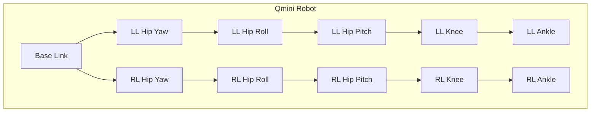

# Unitree Qmini Robot Resources

## 说明

这里不是 Unitree Qmini 机器人的官方 Git 资源库，点击[这里](https://github.com/unitreerobotics/Qmini) 访问官方 Repo.

本仓库包含了**修改**后 Unitree Qmini 机器人打印件，例如将部分螺丝孔位增加了倒角，减少不必要的打印支撑。和其他改装件，和部分为 Qmini 专门设计的 PCB。

### 站立支架

#### 所需材料

- [2040 铝合金型材 x 5](https://www.misumi.com.cn/vona2/detail/110310158399/?ProductCode=LCFB6-2040-200-TPW) 长度最短不小于100mm，两端加工螺纹。
- [M6 x 25mm x 20](https://item.taobao.com/item.htm?id=596366591280&skuId=4312388615153)
- M3 x 14 x 8
- M3 螺母 x 8

## Qmini 结构



```mermaid
flowchart TD
    subgraph "Qmini Robot"
        Body["Base Link"]
        %% Left Leg (LL)
        LL_HipYaw["LL Hip Yaw"]
        LL_HipRoll["LL Hip Roll"]
        LL_HipPitch["LL Hip Pitch"]
        LL_Knee["LL Knee"]
        LL_Ankle["LL Ankle"]
        
        %% Right Leg (RL)
        RL_HipYaw["RL Hip Yaw"]
        RL_HipRoll["RL Hip Roll"]
        RL_HipPitch["RL Hip Pitch"]
        RL_Knee["RL Knee"]
        RL_Ankle["RL Ankle"]
        
        %% Left Leg Connections
        Body --> LL_HipYaw
        LL_HipYaw --> LL_HipRoll
        LL_HipRoll --> LL_HipPitch
        LL_HipPitch --> LL_Knee
        LL_Knee --> LL_Ankle
        
        %% Right Leg Connections
        Body --> RL_HipYaw
        RL_HipYaw --> RL_HipRoll
        RL_HipRoll --> RL_HipPitch
        RL_HipPitch --> RL_Knee
        RL_Knee --> RL_Ankle
    end
```

### How to use the qmini_description

1. Navigate to your workspace:

```bash
$ sudo apt-get install python3-colcon-common-extensions
$ pip install catkin_pkg
$ cd /home/ubuntu/Documents/GitHub/unitree-qmini-robot-components/qmini_description
```

2. Build the package:

```bash
$ colcon build --packages-select qmini_description
```

3. Source the workspace:

```bash
$ source install/setup.bash
```

4. Launch the robot description:

```bash
$ ros2 launch qmini_description view_qmini.launch.py
```