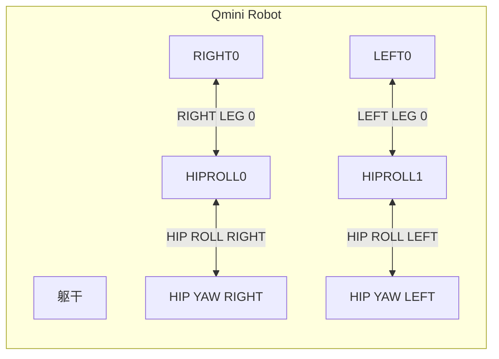

# Unitree Qmini Robot Resources



### How to use the qmini_description

1. Navigate to your workspace:

```bash
$ sudo apt-get install python3-colcon-common-extensions
$ pip install catkin_pkg
$ cd /home/ubuntu/Documents/GitHub/unitree-qmini-robot-components/qmini_description
```

2. Build the package:

```bash
$ colcon build --packages-select qmini_description
```

3. Source the workspace:

```bash
$ source install/setup.bash
```

4. Launch the robot description:

```bash
$ ros2 launch qmini_description view_qmini.launch.py
```